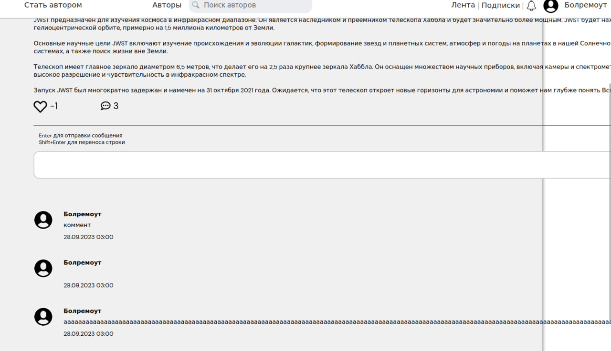

# Домашнее задание по курсу "Обеспечение качества ПО" проекта VK Образование

## Команда: **4from5**

## Содержание

1. [Деплой](#деплой)
2. [Задание](#задание)
3. [Ручное тестирование](#ручное-тестирование)

## Задание

Требуется провести командное тестирование основного функционала сервиса SubMe.

Должны быть протестированы как функциональные, так и нефункциональные характеристики.

## Деплой

[SubMe](https://sub-me.ru/)

# Ручное тестирование

Основные блоки для тестирования:
* [↓](#авторизация) Авторизация
* [↓](#Регистрация) Регистрация
* [↓](#навигация-по-сервису-и-в-меню-настроек) Навигация по сервису и в меню настроек
* [↓](#страница-настроек-профиля) Страница настроек профиля
* [↓](#подписки-и-отслеживания) Страница подписок и отслеживаний
* [↓](#Лента) Страница ленты
* [↓](#Страница-авторов-и-поиск-по-ним) Страница авторов и поиск по ним
* [↓](#стать-автором) Функционал "стать автором"
* [↓](#уведомления) Функционал уведомлений
* [↓](#Функционал-лайков-и-комментариев) Функционал лайков и комментариев
* [↓](#Создание-редактирование-удаление-уровней-подписок) Создание/редактирование/удаление уровней подписок
* [↓](#Страница-статистики) Страница статистики
* [↓](#Создание-редактирование-удаление-поста) Создание/редактирование/удаление поста

## Страница авторов и поиск по ним

**Пример:** [Страница авторов](https://sub-me.ru/search)

**Положительные тесты**

1. При нажатии на карточку любого блога происходит переход именно на его страницу.
2. При вводе в input поле "Поиск авторов" полностью названия блога отображаются искомый блог и другие блоги,
если их название содержит в себе введённый текст.
3. При вводе в input поле "Поиск авторов" общую часть нескольких названий блогов отображаются только искомые блоги.

**Негативные тесты**

1. При вводе в input поле "Поиск авторов" несуществующего названия блога корректно отображается сообщение о том,
что искомый автор не найден.
2. При вводе в input поле "Поиск авторов" спец. символов "/", "&", "?", "@", "#", "$", "%", "=", "+", "\", "[", "]",
":", ";", ",", "." (только один из них или же с сочетанием с любыми другими символами)
выводится изображение "404 Page not found". (Баг)
   
3. При вводе в input поле "Поиск авторов" спец. символ "_" выводятся все карточки авторов. (Баг)
   
4. При вводе в input поле "Поиск авторов" emoji (или другие символы, которые не являются символами кириллицы и латиницы, цифрами и
   символами-разделителями) корректно отображается сообщение о том,
   что искомый автор не найден.

## Страница статистики

**Пример:** [Страница статистики](https://sub-me.ru/finance)
###### Для просмотра данной страницы, вы должны быть автором

**Положительные тесты**

1. При создании нового поста количество постов в статистике корректно увеличилось на один.
2. При удалении поста количество постов в статистике корректно уменьшилось на один.
3. При нажатии на иконку лайка под постом другим пользователем количество лайков в статистике автора корректно увеличивается на один.
4. При повторном нажатии на иконку лайка под постом другим пользователем количество лайков в статистике корректно уменьшается на один.
5. При нажатии на странице автора другим пользователем кнопки "Отслеживать" в статистике автора количество наблюдателей корректно увеличилось на один.
6. При нажатии на странице автора другим пользователем кнопки "Перестать отслеживать" в статистике автора количество наблюдателей осталось прежним вместо того, чтобы уменьшиться. (Баг)
7. При добавлении комментария на пост другим пользователем количество комментариев в статистике автора не увеличивается. (Баг)
8. При добавлении комментария на пост самим автором количество комментариев в статистике автора не увеличивается. (Баг)
9. При удалении комментария на пост самим автором количество комментариев в статистике автора не уменьшается. (Баг)
10. При удалении комментария на пост другим пользователем количество комментариев в статистике автора не уменьшается. (Баг)
11. При выборе просмотра статистики за определённый период, если выбрать начальный месяц, который идёт раньше месяца
начала ведения автором блога, а конечный оставить неизменным, также отображается статистика с начала ведения автором
блога до нынешнего месяца.
12. При выборе просмотра статистики за определённый период, если выбрать начальный и конечный месяцы, которые оба идут
раньше месяца начала ведения автором блога, ничего не меняется.
13. При выборе просмотра статистики за определённый период, если выбрать начальный и конечный месяцы, которые оба идут
позже нынешнего, статистика показывает по всем параметрам нули.

**Негативные тесты**

1. При попытке перехода на данную страницу, не являясь автором, возникает пустая белая страница. (Баг)

2. При попытке перехода на данную страницу без входа в аккаунт возникает пустая белая страница. (Баг)

3. При выборе просмотра статистики за определённый период, если выбрать начальный месяц, который будет идти позже
конечного, возникает сообщение о том, что начальный месяц дальше конечного.

## Регистрация

**Пример:** [Нажмите на кнопку "Регистрация" на главной странице](https://sub-me.ru/)

**Положительные тесты**

1. При нажатии на кнопку "Войти" переносит на авторизацию, откуда можно вернуться при нажатии на кнопку
"Регистрация".
2. При нажатии на зону вне модального окна регистрации модальное окно закрывается, страница на заднем фоне становится
активной.
3. При вводе любого набора символов в input поля "Пароль" или "Повторите пароль" текст отображается в виде точек.
При нажатии на иконку глаза текст отображается в нормальном виде. При повторном нажатии - снова отображается в виде точек.
4. При вводе любого набора символов в input поля "Имя пользователя" и "Логин" и нажатии на иконку крестика текст стирается,
отображается placeholder.
5. При вводе в input поле "Имя пользователя" любого набора символов длиной от 1 до 30 символов, состоящего только из символов кириллицы и латиницы, цифр
и символов-разделителей и содержащего хотя бы одну букву, и затем при нажатии на кнопку "Зарегистрироваться" input поле цветом
не выделяется и не имеет рядом сообщений об ошибке.
6. При вводе в input поле "Логин" любого набора символов длиной от 7 до 20 символов, состоящего только из латинских символов, цифр
и символов-разделителей и содержащего хотя бы одну букву, и затем при нажатии на кнопку "Зарегистрироваться" input поле цветом
не выделяется и не имеет рядом сообщений об ошибке. 
7. При вводе в input поле "Пароль" любого набора символов длиной от 7 до 20 символов, состоящего только из латинских символов, цифр
и символов-разделителей и содержащего хотя бы одну цифру, и затем при нажатии на кнопку "Зарегистрироваться" input поле цветом
не выделяется и не имеет рядом сообщений об ошибке.
8. При вводе в input поле "Повторите пароль" тот же набор символов, что и в input поле "Пароль" по аналогичным требованиям
из пункта 7, и затем при нажатии на кнопку "Зарегистрироваться" input поля "Повторите пароль" и "Пароль" цветом не выделяется
и не имеет рядом сообщений об ошибке.
9. При выполнении пунктов 5, 6, 7 и 8 (приведены выше) и нажатии на кнопку "Зарегистрироваться" пользователя переносит на главную страницу,
где пропадают кнопки "Войти" и "Регистрация" и возникают логин пользователя и другой функционал ("Стать автором", "Лента",
"Подписки", "Уведомления").

**Негативные тесты**

1. При нажатии на кнопку "Зарегистрироваться" с пустыми input полями возникают сообщения рядом с каждым полем о том,
что поля должны содержать определённое количество символов, и input поля выделяются цветом.
2. При вводе emoji в любое input поле возникает сообщение о том, что допустимы только латинские символы, цифры
и символы-разделители (для input полей "Логин" и "Пароль") и допустимы только символы кириллицы и латиницы, цифры и 
символы-разделители (для input поля "Имя пользователя").
3. При вводе в одно из input полей ("Имя пользователя", "Логин", "Пароль") минимального допустимого количества символов
(для имени пользователя 1 символ, для логина и пароля 7 символов), представляющих собой спец. символы
(к примеру, "."), и при нажатии кнопки "Зарегистрироваться" данное input поле выделяется цветом, под ним выходит
сообщение о том, что поле должно содержать хотя бы 1 букву (для поля "Имя пользователя" и "Логин") или поле должно 
содержать хотя бы 1 цифру (для поля "Пароль").
4. При вводе в одно из input полей ("Имя пользователя", "Логин") минимального допустимого количества символов
(для имени пользователя 1 символ, для логина 7 символов), представляющих собой цифры
(к примеру, "1"), и при нажатии кнопки "Зарегистрироваться" данное input поле выделяется цветом, под ним выходит
сообщение о том, что поле должно содержать хотя бы 1 букву.
5. При вводе в input поле "Пароль" минимального допустимого количества символов (7 символов), представляющих собой
латинские буквы (к примеру, "r"), и при нажатии кнопки "Зарегистрироваться" данное input поле выделяется цветом,
под ним выходит сообщение о том, что поле должно содержать хотя бы 1 цифру.
6. При выполнении пунктов 5, 6, 7 из положительных тестов, однако с несовпадающими текстами в input полях "Пароль" и "Повторите пароль" (второе
может быть пустым, иметь символ, который не латинский символ, цифра или символ-разделитель, может иметь любую длину) и
нажатии на кнопку "Зарегистрироваться" оба input поля выделяется цветом, под ними отображается сообщение "Пароли не совпадают"
7. После успешной регистрации, выхода из учётной записи, а затем при попытке снова заполнить форму регистрации
с тем же логином, что и при прохождении регистрации в первый раз, при выполнении пунктов 5, 7, 8 из положительных тестов
и нажатии на кнопку "Зарегистрироваться" возникает сообщение "Введённые данные некорректны", пользователь остаётся в
этом же модальном окне. (Баг)
   
   
   
8. После успешной регистрации, выхода из учётной записи, а затем при попытке снова заполнить форму регистрации
с тем же именем пользователя, или паролем, или и тем, и другим, что и при прохождении регистрации в первый раз,
при выполнении пунктов 5, 6, 7, 8 из положительных тестов и нажатии на кнопку "Зарегистрироваться" пользователь успешно
регистрируется. Его переносит на главную страницу, где пропадают кнопки "Войти" и "Регистрация" и возникают логин
пользователя и другой функционал ("Стать автором", "Лента", "Подписки", "Уведомления").

## Авторизация

### Авторизация
**Пример:** [Нажмите на кнопку "Войти" на главной странице](https://sub-me.ru/)

**Положительные тесты**

1. При вводе верного логина и пароля зарегистрированного пользователя, происходит редирект на главную страницу и в топбаре появляется имя пользователя, а также дополнительная навигация по сервису.
2. При вводе логина в инпут поле и нажатии на иконку "крестика", инпут поле логина очищается.
3. При первом нажатии на иконку "глаза" содержимое инпута поля пароля показывается пользователю.
4. При повторном нажатии на на иконку "глаза" содержимое инпута поля пароля отображается в виде символов '*'.

**Негативные тесты**

1. При нажатии на кнопку "Войти" с логином, уже зарегистрированного пользователя, и пустым паролем, выводится сообщение о неверном логине или пароле.
2. При нажатии на кнопку "Войти" с паролем, уже зарегистрированного пользователя, и пустым логином, выводится сообщение о неверном логине или пароле.
3. При нажатии на кнопку "Войти" с паролем, уже зарегистрированного пользователя, и неверным логином, выводится сообщение о неверном логине или пароле.
4. При нажатии на кнопку "Войти" с логином, уже зарегистрированного пользователя, и неверным паролем, выводится сообщение о неверном логине или пароле.
5. При пустом инпут поле логина и нажатии на иконку "крестика" инпут поле остаётся пустым.

## Навигация по сервису и в меню настроек

**Пример:** [Главная страница](https://sub-me.ru/)

**Положительные тесты**

**Тесты для неавторизованного пользователя**

1. При нажатии на кнопку "Регистрация", открывается модальное окно для регистрации, но URL не меняется( **баг**, ожидается URL: https://sub-me.ru/signUp).
2. При нажатии на кнопку "Войти", открывается модальное окно для входа в аккаунт, но URL не меняется( **баг**, ожидается URL: https://sub-me.ru/signIn).
3. При нажатии на кнопку "Авторы", открывается [страница с карточками авторов](https://sub-me.ru/search).
4. При нажатии на кнопку "О нас", открывается [страница с описанием сервиса](https://sub-me.ru/).
5. При нажатии на логотип сервиса, открывается [страница с описанием сервиса](https://sub-me.ru/).
6. При вводе запроса в поле "Поиск автора" происходит переход на [вкладку авторы](https://sub-me.ru/search).

**Тесты для авторизованного пользователя**

1. При нажатии на кнопку "Лента" на любой странице сервиса, открывается [страница с лентой пользователя](https://sub-me.ru/feed).
2. При нажатии на кнопку "Подписки", открывается [страница с подписками пользователя](https://sub-me.ru/subscriptions).
3. При нажатии на кнопку "Стать автором", открывается модальное окно для ввода информации о блоге.
4. При нажатии на кнопку с иконкой уведомлений, открывается окно с уведомлениями пользователя.
5. При нажатии на имя пользоваетеля, появляется выпадающий список с кнопками "Настройки", "Выйти".
6. При нажатии на кнопку "Настройки", открывается [страница с найтройками пользователя](https://sub-me.ru/settings).
7. При нажатии на кнопку "Выйти", происходит редирект на [главную страницу сервиса](https://sub-me.ru/) и выход из пользовательского аккаунта, меняется навигация доступная в топбаре на кнопки "О нас", "Авторы", "Войти", "Зарегистрироваться", поле "Поиск автора".

**Тесты для авторизованного пользователя с авторским блогом**

1. При нажатии на кнопку "Моя страница", открывается [страница с авторским блогом пользователя](https://sub-me.ru/creatorPage).
2. При нажатии на имя пользоваетеля, появляется выпадающий список с кнопками "Моя страница", "Мои доходы", "Настройки","Выйти".
3. При нажатии на кнопку "Мои доходы" , открывается [страница со статистикой по авторскому блогу пользователя](https://sub-me.ru/finance).

## Страница настроек профиля

**Пример:** [Настройки](https://sub-me.ru/settings)

**Положительные тесты**

1. При вводе **имени пользователя** латинницой/кириллицей короче 31 символа и нажатии кнопки "сохранить", данные
   сохраняются
   и выводится сообщение
   об успешном сохранении.
2. При вводе **имени пользователя** короче 31 символа, содержащего буквы и цифры, и нажатии кнопки "сохранить", данные
   сохраняются и
   выводится сообщение об успешном сохранении.
3. При вводе **имени пользователя** короче 31 символа, содержащего буквы и символы разделители('_',' '), и нажатии кнопки "
   сохранить", данные сохраняются и выводится сообщение об успешном сохранении.
4. При вводе **логина** латинницой/кириллицей длиннее 7 и короче 21 символа и нажатии кнопки "сохранить", данные сохраняются и
   выаодится
   сообщение об успешном сохранении.
5. При вводе **логина** длиннее 7 и короче 21 символа, содержащего буквы и цифры, и нажатии кнопки "сохранить", данные сохраняются и
   выаодится
   сообщение об успешном сохранении.
6. При вводе **логина** длиннее 7 и короче 21 символа, содержащего буквы и символы разделители('_',' '), и нажатии кнопки "
   сохранить", данные сохраняются и выводится сообщение об успешном сохранении.
7. При корректном вводе старого **пароля** и нового латинницой/кириллицей, содержащего число и длиннее 7 и короче 21 символа, и нажатии кнопки "сохранить", данные сохраняются и
   выводится сообщение об успешном сохранении.
8. При нажатии на кнопку "Выбрать фото" для обновления **фото профиля** открывается файловый проводник, при загрузке jpeg/jpg/png размером менее 5 МБ, фото успешно обновляется.
9. При нажатии на кнопку "Удалить фото" у **фото профиля**, предыдущее фото успешно удаляется.

**Негативные тесты**

1. При вводе **имени пользователя**, содержащего спец. символы и нажатии кнопки "сохранить", данные не сохраняются
   и выводится сообщение о том, что введённые данные некорректны.
2. При вводе **имени пользователя** длиннее 30 символов и нажатии кнопки "сохранить" выводится сообщение о некорректной
   длине введённых данных.
3. При вводе пустого **имени пользователя** и нажатии кнопки "сохранить" выводится сообщение о некорректной длине
   введённых
   данных.
4. При вводе **имени пользователя**, содержащего символ отличный от кириллицы/латинницы, цифры или спец.символа(например, emoji), и нажатии кнопки "сохранить", данные не сохраняются
   и выводится сообщение о том, что введённые данные некорректны.
5. При вводе **имени пользователя**, содержащего только цифры и нажатии кнопки "сохранить", данные не сохраняются
   и выводится сообщение о том, что имя пользователя должно содержать хотя бы одну букву. 
6. При вводе **логина**, содержащего только цифры и нажатии кнопки "сохранить", данные не сохраняются
   и выводится сообщение о том, что логин должен содержать хотя бы одну букву.
7. При вводе пустого **логина** и нажатии кнопки "сохранить" выводится сообщение о некорректной длине
   введённых
   данных.
8. При вводе **логина**, содержащего символ отличный от кириллицы/латинницы, цифры или спец.символа(например, emoji), и нажатии кнопки "сохранить", данные не сохраняются
   и выводится сообщение о том, что введённые данные некорректны.
9. При вводе **логина** длиннее 20 символов или короче 7 и нажатии кнопки "сохранить" выводится сообщение о некорректной
   длине введённых данных.
10. При вводе **логина**, содержащего спец. символы и нажатии кнопки "сохранить", данные не сохраняются
    и выводится сообщение о том, что введённые данные некорректны.
11. При нажатии на кнопку "Сохранить" без изменения данных, выводится сообщение о том, что новые данные пользователя
   совпадают со старыми данными.
12. При вводе **логина**, занятого другим пользователем и нажатии кнопки "сохранить", данные не сохраняются
    и не выводится никакого сообщения.(баг)
13. При вводе нового **пароля** длиннее 20 символов или короче 7 и нажатии кнопки "сохранить" выводится сообщение о некорректной
    длине введённых данных.
14. При вводе нового **пароля** не содержащего цифру и нажатии кнопки "сохранить" выводится сообщение,что пароль должен содержать цифру.
15. При вводе несовпадающих старого и нового **паролей** и нажатии кнопки "сохранить" выводится сообщение, что пароли не совпадают.
16. При вводе нового **пароля**, содержащего символы отличные от латинницы/кириллицы, цифры или спец.символа(например, emoji), и нажатии кнопки "сохранить" выводится сообщение о некорректных данных.
17. При нажатии на кнопку "Удалить фото" у **фото профиля**, если у пользователя нет фото, ссообщение об ошибке не выводится.(баг)
18. При загрузке нового **фото профиля** в формате jpeg/jpg/png размером более 5 Мб отображается сообщение об ошибке.
19. При загрузке нового **фото профиля** в любом формате кроме jpeg/jpg/png(например .json) не отображается сообщение об ошибке.(баг)

## Стать автором

**Тесты для авторизованного пользователя**
1. При нажатии на пункт меню "Стать автором" отыкрывается модальное окно для ввода данных
2. При нажатии кнопки "Стать автором" в соответвующем модальном окне открывается страница созданного автора

**Положительные тесты**
1. При вводе **Названия блога** короче 41 символа, содержащего буквы и цифры, и нажатии кнопки "Стать автором", данные
   сохраняются и
   открывается новая страница автора.
2. При вводе **Названия блога** длиннее 0 и короче 41 символа, содержащего буквы и символы разделители('_',' '), и нажатии кнопки "
   Стать автором", данные сохраняются и открывается новая страница автора.
3. При вводе **Названия блога** латинницой/кириллицей длиннее 0 и короче 41 символа и нажатии кнопки "Стать автором", данные сохраняются и
   открывается новая страница автора.
4. При вводе **Названия блога** длиннее 0 и короче 41 символа, содержащего буквы и цифры, и нажатии кнопки "Стать автором", данные сохраняются и
   открывается новая страница автора.
5. При вводе валидного **Названия блога** и **Описания блога**, короче 501 символа, содержащего буквы и цифры, и нажатии кнопки "Стать автором", данные
   сохраняются и
   открывается новая страница автора.
6. При вводе валидного **Названия блога** и **Описания блога**, короче 501 символа, содержащего буквы и символы разделители('_',' '), и     нажатии кнопки "
   Стать автором", данные сохраняются и открывается новая страница автора.
7. При вводе валидного **Названия блога** и **Описания блога** латинницой/кириллицей короче 501 символа и нажатии кнопки "Стать автором", данные сохраняются и
   открывается новая страница автора.
8. При вводе валидного **Названия блога** и **Описания блога**, короче 501 символа, содержащего буквы и цифры, и нажатии кнопки "Стать автором", данные сохраняются и
   открывается новая страница автора.

**Негативные тесты**
1. При вводе пустого **Названия блога** и нажатии кнопки "Стать автором", данные не сохраняются
   и выводится выводится сообщение о некорректной
   длине введённых данных.
2. При вводе **Названия блога** длиннее 40 символов и нажатии кнопки "Стать автором" выводится сообщение о некорректной
   длине введённых данных.
3. При вводе **Названия блога**, содержащего символ отличный от кириллицы/латинницы и цифр(например, emoji), и нажатии кнопки "сохранить", данные не сохраняются
   и выводится сообщение о том, что введённые данные некорректны.
4. При вводе **Названия блога**, содержащего только цифры и нажатии кнопки "сохранить", данные не сохраняются
   и выводится сообщение о том, что имя пользователя должно содержать хотя бы одну букву. 
5. При вводе **Описания блога** длиннее 500 символов и нажатии кнопки "Стать автором" выводится сообщение о некорректной
   длине введённых данных.
6. При вводе **Описания блога**, содержащего символ отличный от кириллицы/латинницы и цифр(например, emoji), и нажатии кнопки "Стать автором",  выводится сообщение о том, что введённые данные некорректны.

## Уведомления

**Положительные тесты**
1. Если пользователь отслеживает автора и автор выложит новый пост, то пользователь **получит** **Уведомление** об этом в пункте меню "Колокольчик"
2. В случае наличия уведомления у пользователя, пункт меню "Колокольчик" **изменит** свою иконку и появится зелёная точка.
3. При отслеживании автора пользователь получит уведомление о новом его посте.

**Негативные тесты**
1. Если пользователь перестал отслеживать автора или никогда не отслеживал его, и автор выложит новый пост, то пользователь **не получит** **Уведомление** об этом в пункте меню "Колокольчик".

## Подписки и отслеживания

**Тесты для авторизованного пользователя**
1. При нажатии кнопки меню "Подписки" открывается страница с пунктами "Платные подписки" и "Отслеживаются"
2. При нажатии кнопки "Отслеживать" на странице автора, данный автор добавляется в список отслеживаемых в пункте меню "Подписки"
3. При нажатии кнопки "Престать отслеживать" на странице автора, данный автор пропадает из списка отслеживаемых в пункте меню "Подписки"

---

## Лента

**Пример:** [Лента](https://sub-me.ru/feed)

**Положительные тесты**

1. Если пользователь подписан или отслеживает автора, у которого есть посты, к которым у пользователя есть доступ, они
   появятся в ленте пользователя.

**Негативные тесты**

1. Если пользователь не подписан и не отслеживает ни одного автора, его лента будет пустая
   (появится картинка, говорящая о том, что у пользователя нет постов в ленте)

## Функционал лайков и комментариев

**Пример:** [необходимо нажать на значок комментария под постом](https://sub-me.ru/creatorPage/e175f8e2-2b4a-48ef-bf43-c55305aaf183)

**Положительные тесты**

1. При клике на кнопку лайка количество лайков поста прибавляется на 1, и лайк загорается красным.
2. При повторном клике на кнопку лайка перестает гореть (становится серым), и их количество уменьшается на 1.
3. При клике на значок комментария
   открывается [страница поста вместе с комментариями](https://sub-me.ru/creatorPage/e175f8e2-2b4a-48ef-bf43-c55305aaf183)
4. При написании валидного комментария в инпут-поле и нажатия на кнопку Отправить, комментарий появляется внизу поста.
   При этом текст из инпут-поля исчезает, количество комментариев увеличится на 1.
5. При написании валидного комментария в инпут-поле и нажатия кнопки Enter, комментарий появляется внизу поста.
   При этом текст из инпут-поля исчезает, количество комментариев увеличится на 1.
6. При нажатии сочетания клавиш Shift-Enter во время ввода комментария, произойдет перенос строки.
7. При нажатии на кнопку редактирования комментария, вместо текста комментария появится инпут-поле с текстом комментария
8. При нажатии на кнопку Отправить (рядом с комментарием) инпут-поле редактирования исчезнет, вместо него появится
   отредактированный комментарий.
9. При нажатии на кнопку отмены редактирования инпут-поле редактирования исчезнет, а текст комментария останется
   прежним.
10. При нажатии на кнопку удаления комментария, комментарий удалится, количество комментариев под постом уменьшится на
    1.

**Негативные тесты**

1. Если ничего не вводить в поле комментария и нажать на кнопку Отправить, ничего не произойдет.
2. Если ввести в поле комментария пробелы (и больше ничего) и нажать на кнопку Отправить, создастся пустой
   комментарий. (баг)
3. Если ввести в комментарии слово, которое не помещается на странице, комментарий вылезет за пределы страницы. (баг)
   
4. Если ввести комментарий, больше 217 символов длины, он не сохранится. (баг)
   
   

## Создание, редактирование, удаление уровней подписок

**Пример:** [необходимо нажать на кнопку добавления уровня подписки, только для зарегистрированных авторов](https://sub-me.ru/creatorPage)

**Положительные тесты**

1. Если нажать на кнопку создания уровня подписки, всплывет окно с полями для создания подписки.
2. Если заполнить окно создания подписки корректными данными и нажать кнопку Сохранить, окно создания подписки пропадет,
   и в плашке с подписками появится только что созданная подписка.
3. Если количество подписок в плашке превысит 4 штуки, последние подписки отображаться не будут, а около плашки появятся
   стрелки для переключения между страничками подписок. Не вошедшие подписки будут на другой страничке.
4. При нажатии на кнопку Изменить на подписке, появится окно изменения подписки с заполненными полями,
   соответствующими прежнему содержанию подписки.
5. При нажатии на кнопку Удалить подписка удалится и исчезнет из поля "Подписки" страницы автора.

**Негативные тесты**

1. Если у автора нет уровней подписок, на плашке с подписками высвечивается надпись "У вас пока нет ни одной подписки".
2. Если автор введет название подписки больше 40 символов, появится сообщение об ошибке.
3. Если автор введет описание подписки больше 200 символов, появится сообщение об ошибке.
4. Если ввести в поле названия или описания подписки что-либо кроме символов кириллицы и латиницы, цифр и
   символов-разделителей,
   появится сообщение об ошибке.
5. Если ввести в поле цены подписки что-либо кроме чисел, появится сообщение об ошибке.
6. Если ввести в поле цены подписки меньше 2 рублей или больше 1 млн рублей, появится сообщение об ошибке.
7. Если не ввести описание подписки и нажать Сохранить, то вся плашка с подписками исчезнет. (баг)
   

## Создание, редактирование, удаление поста

**Пример:** [необходимо быть зарегистрированным автором](https://sub-me.ru/newPost)

**Положительные тесты**

1. При нажатии на кнопку Создать пост, произойдет переход на страницу создания поста.
2. На странице создания поста при нажатии на кнопку Назад, произойдет переход обратно на страницу автора
3. Если выбрать на плашке "Кто может смотреть" кнопку "Только подписчики", то раскроется список уровней подписок.
4. При клике на один из уровней подписок, он загорится зеленым. При повторном клике он перестанет гореть (станет серым).
5. Если выбрать на плашке "Кто может смотреть" кнопку "Открыт для всех", список уровней подписок исчезнет.
6. При клике на одну из кнопок Фото, Видео или Аудио, у пользователя откроется файловая система, где он сможет выбрать
   вложение.
7. При выборе вложения, если его размер не будет превышать 5 Мб, оно появится внизу страницы создания поста.
8. При нажатии на кнопку Удалить возле вложения, оно исчезнет.
9. Если правильно заполнить хотя бы название поста и нажать кнопку Сохранить, произойдет переход на страницу автора,
   где появится созданный пост. Пост будет содержать те уровни доступа, которые были выбраны на вкладке
   "Кто может смотреть", и те вложения, которые он выбрал.
10. При нажатии на кнопку Изменить возле поста, автор перейдет на страницу поста с тем названием, текстом и вложениями,
    которые были у этого поста.
11. При нажатии на кнопку Сохранить, автор перейдет на страницу автора, где будет находиться измененный пост.
12. При нажатии на кнопку Удалить рядом с постом, пост исчезнет.

**Негативные тесты**

1. Если у автора нет ни одного поста, у него на странице появится надпись "Вы пока не добавили ни одного поста"
2. Если ввести в поле названия или текста поста что-либо кроме символов кириллицы и латиницы, цифр и
   символов-разделителей,
   появится сообщение об ошибке.
3. Если оставить поле названия поста пустым, появится сообщение об ошибке.
4. Если в поле названия поста ввести больше 40 символов, появится сообщение об ошибке.
5. При нажатии на кнопку Изменить возле поста, автор перейдет на страницу поста, где по умолчанию будут выбран доступ
   "Открыт для всех". (баг)
