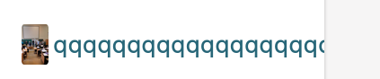
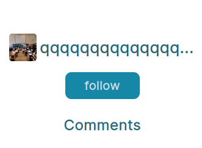
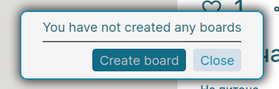
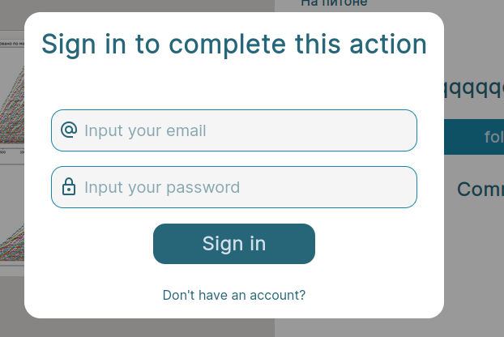

# Домашнее задание 1. Тестирование сервиса pickpin

<!--toc:start-->

## Оглавление

- [Домашнее задание 1. Тестирование сервиса pickpin](#домашнее-задание-1-тестирование-сервиса-pickpin)
  - [Состав команды:](#состав-команды)
  - [Деплой](#деплой)
  - [Тестирование](#тестирование)
    - [Авторизация](#авторизация)
    - [Регистрация](#регистрация)
    - [Лента](#лента)
    - [Профиль](#профиль)
    - [Просмотр пина](#просмотр-пина)
    - [Cоздание пина](#cоздание-пина)
    - [Создание доски](#создание-доски)

## Состав команды:

- [Киселев Кирилл](https://github.com/t1d333)
- [Шагалов Вячеслав](https://github.com/SlavaShagalov)
- [Евгений Дмитриев](https://github.com/UjinIaly)

## Деплой

PickPin: http://146.185.241.113

## Тестирование

### Авторизация

Ссылка: http://146.185.241.113/login

**Позитивные кейсы:**

- При вводе неправильной почты или пароля в ответ на запрос авторизации появляется сообщение "Wrong email or password"

**Негативные кейсы:**

- правильно валидируется почта.
  - слова без "@" не считаются валидной почтой
  - слова вида word@ не считаются валидной почтой
  - слова вида word@.domen не считаются валидной почтой
- При попытке заполнить не все поля и отправить запрос на авторизацию появляется сообщение "All fields must be filled!"

### Регистрация

Ссылка: http://146.185.241.113/signup

**Позитивные кейсы**

- Можно указать имя пользователя на кириллице

**Негативные кейсы**

- При попытке отправить запрос на регистрацию с незаполненными полями, появляется сообщение "All fields must be filled!"
- При попытке ввода имени пользователя короче 4-х символов, появляется сообщение "Username must be at least 4
  characters"
- При попытке ввести невалидную(см. пункт в авторизации), почты появляется сообщение "Invalid email"
- При попытке ввести пароль короче 8 символов, появляется сообщение "Password must be at least 8 characters"
- При попытке ввести пароль без больших букв, появляется сообщение "Password must contain one or more uppercase letters"
- При попытке ввести пароль без цифр, появляется сообщение "Password must contain one or more digits"
- При попытке ввести пароль без специальных символов(\_\-#!$@%^&\*+~=:;?/), появляется сообщение "Password must contain
  one or more special characters"

### Лента

**Позитивные кейсы**

- Для неавторизованных пользователей на странице ленты отображаются кнопки для входа/регистрации
- При попытке поставить лайк, будучи неавторизованным, появляется модальное окно с формой авторизации
- При попытке создать пин/доску, будучи неавторизованным, появляется модальное окно с формой авторизации
- При попытке сохранить пин, будучи неавторизованным, появляется модальное окно с формой авторизации
- При попытке перейти в профиль, будучи неавторизованным, появляется модальное окно с формой авторизации
- При попытке перейти в избранные пины, будучи неавторизованным, появляется модальное окно с формой авторизации
- При сохранение пина на доску, появляется попап, уведомляющий об успешном сохранении.

**Негативные кейсы**

- При попытке сохранить пин на доску, на которой он уже есть, появляется попап, с сообщением "The pin has already been
  saved on this board"

### Профиль

Ссылка: http://146.185.241.113/settings

**Позитивные кейсы**

- При попытке выйти из аккаунта происходит выход из аккаунта
- При загрузке картинки для смены аватара появляется превью новой аватарки.
- При сохранении нового аватара - аватар сохраняется.
- При сохранении нового username длиной более 3 символов и менее 30 символов - username сохраняется.
- При сохранении нового username, состоящего из одних цифр - username сохраняется.
- При сохранении нового name, состоящего из одних цифр - name сохраняется.
- При сохранении нового непустого name длиной менее 60 символов - name сохраняется.

**Негативные кейсы**

- При сохранении нового username длиной менее 3 символов выводится сообщение "username must be at least 4 characters".
- При сохранении нового username длиной более 30 символов выводится сообщение "username must be no more than 30
  characters".
- При сохранении нового Name, заданного пустой строкой, выводится сообщение "Name must be not empty".
- При сохранении нового Name, длиной более 60 символов, выводится сообщение "name must be no more than 60 characters".

**Баги**

- При сохранении нового username длиной менее 3 символов - в поле ввода username отображается undefined.
- При сохранении нового username длиной более 30 символов - в поле ввода username отображается undefined.
- При сохранении нового Name, заданного пустой строкой, не выводится сообщение "Name must be not empty".
- При сохранении нового Name, длиной более 60 символов - в поле ввода name отображается undefined.

### Просмотр пина

Ссылка: http://146.185.241.113/pin/1

**Позитивные кейсы**

Блок комментариев:

- При попытке добавить непустой комментарий - комментарий добавляется.
- При попытке добавить комментарий, состоящий только из пробелов, комментарий добавляется.

Верхняя панель кнопок:

- При попытке поставить лайк - ставится лайк.
- При попытке поставить лайк, будучи неавторизованным - появляется модальное окно с формой авторизации.
- При попытке нажатия на кнопку поделиться - копируется в буфер короткая ссылка на пин и отображается сообщение об
  успешном копировании ссылки.
- При сохранении пина на доску, на которой его еще нет, происходит сохранение и выводится сообщение "Pin saved
  successfully!".
- При сохранении пина на доску, на которой он уже есть, выводится сообщение "The pin has already been saved on this
  board".

Кнопка подписки:

- При попытке подписаться, происходит подписка, кнопка изменяется.
- При попытке отписаться, происходит отписка, кнопка изменяется.
- При попытке подписаться, будучи неавторизованным - появляется модальное окно с формой авторизации.

Блок комментариев:

- При попытке оставить комментарий, будучи неавторизованным - появляется модальное окно с формой авторизации.

**Негативные кейсы**

Блок пользователя:

- При длинном имени пользователя оно не обрезается и аватар пользователя становится не пропорциональным .

  Пример корректного отображения
  

Блок комментариев:

- При попытке добавить пустой комментарий - ничего не происходит.

**Баги**

- При попытке отрытия списка доступных досок, будучи неавторизованным, появляетмя уведомление
  

  , а должно появляться модально окно с формой авторизации
  

- При попытке нажатия на кнопку поделиться - не копируется в буфер короткая ссылка на пин и не отображается сообщение об
  успешном копировании ссылки. Появляется ошибка в консоли

### Cоздание пина

Ссылка: http://146.185.241.113/pin-builder

**Позитивные кейсы**

- При попытке загрузить картинку появляется превью этой картинки.
- При попытке сохранить пин с непустыми name и description и загруженной картинкой пин сохраняется.

**Негативные кейсы**

- При попытке сохранить пин с пустым полем name, появляется сообщение "All fields must be filled".
- При попытке сохранить пин с пустым полем description, появляется сообщение "All fields must be filled".

### Создание доски

Ссылка: http://146.185.241.113/feed, необходимо нажать на кнопку создания доски справа от поиска.

**Позитивные кейсы**

- При попытке сохранить доску с непустым названием доска успешно сохраняется.
- При попытке сохранить доску с названием, состоящим только из пробелов, доска успешно сохраняется.

**Негативные кейсы**

- При попытке сохранить доску с пустым названием, появляется сообщение "Enter board name".
