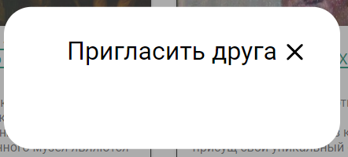

# Wild Spirits

### Проект: https://event-radar.ru

## Карточка мероприятия

- При наведении мыши на любое место карточки курсор становится поинтером, при наведении на функциональные элементы, они подсвечиваются зелёным

- При клике на любое место карточки, кроме функциональных элементов (кнопок лайка, приглашения, добавления в запланированные мероприятия) происходит редирект на страницу мероприятия
  
- Для неавторизованного пользователя:
  - При клике на кнопки лайка и добавления в запланированные мероприятия происходит редирект на логин
  - При клике на кнопку приглашения происходит редирект на регистрацию, а не на логин
  
- Для авторизованного пользователя:
  - При клике на лайк:
    - иконка лайка становится заполненной
    - счётчик лайков на карточке увеличивается на 1
    - карточка мероприятия появляется в карусели с понравившимися мероприятиями, если понравившихся мероприятий больше 3, карусель становится активной для перемотки

  - При снятии лайка:
    - иконка лайка становится незаполненной
    - счётчик лайков на карточке уменьшается на 1
    - карточка мероприятия убирается из карусели с понравившимися, если больше понравившихся мероприятий нет, сама карусель пропадает

  - При клике на кнопку приглашения:
    - При отсутствии подписок видим пустое модальное окно
    
    - При наличии подписок открывается модальное окно приглашения на мероприятие
  
  - При клике на кнопку добавления в запланированные мероприятия:
    - иконка кнопки становится заполненной
    - карточка мероприятия появляется в карусели с запланированными мероприятиями, если запланированных мероприятий больше 3, карусель становится активной для перемотки
    - никаких уведомлений о предстоящем мероприятии не приходит: ни на почту, ни в уведомлениях сайта
  
  - При повторном клике на кнопку добавления в запланированные мероприятия:
    - иконка кнопки становится незаполненной
    - карточка мероприятия убирается из карусели с запланированными, если больше запланированных мероприятий нет, сама карусель пропадает

## Страница просмотра мероприятия

- При наведении и клике на кнопки лайка и добавления в запланированные поведение аналогично поведению этих кнопок на карточке мероприятия
- При нажатии на логотип VK открывается vk.com/share.php с предложением поделиться ссылкой: сделать пост на стене, в сообществе или отправить в личные сообщения
- При нажатии на логотип Telegram открывается t.me/share, кнопка share ничего не делает. Если поставить десктопное приложение Telegram, браузер предлагает открыть его. В приложении удается поделиться ссылкой
- Ссылка отображается без какого-либо оформления. При нажатии на ссылку открывается ожидаемая страница мероприятия

## Модальные окна

- При наведении на кнопку закрытия курсор становится поинтером
- Окно закрывается при нажатии на кнопку закрытия
- Окно закрывается при нажатии на любое место вне окна

## Модальное окно приглашения на мероприятие

- Никнеймы подписок выделяются зеленым при наведении мыши, но курсор не меняется на поинтер, клик на никнейм не приводит к редиректу на страницу подписки
- Кнопки приглашения выделяются зелёным при наведении, курсор становится поинтером
- При нажатии на кнопку приглашения не происходит отлика для пользователя - непонятно, отправилось ли приглашение. Окно остается открытым

## Получение приглашения

- При получении приглашения уведомление появляется на колокольчике у ссылки на профиль, но только при перезагрузке страницы (nginx недонастроили, видимо)
- Приглашение не приходит на почту, указанную при регистрации
- При нажатии на колокольчик открывается модальное окно с уведомлениями
- При принятии/отклонении приглашения в одной вкладке браузера, приглашении все ёще существует в других вкладках. Попытка повторно принять/отклонить не даёт никакой реакции, в консоли 404 из-за отсутствия приглашения.

## Модальное окно уведомлений

- При наведении мыши на изображение/название мероприятия курсор становится поинтером, нажатие редиректит на страницу мероприятия
- При наведении мыши на аватарку/никнейм пользователя курсор становится поинтером, аватарка подсвечивается, нажатие редиректит на страницу пользователя
- Нажатие на крестик у приглашения отклоняет его - приглашение больше не появляется в списке уведомлений
- Нажатие на галочку у приглашения принимает его - приглашение больше не появляется в списке уведомлений, мероприятие появляется в карусели запланированных
- При повторном принятии приглашения на то же мероприятие, мероприятие не пропадает из карусели запланированных
