## Кнопка "Создать мероприятия"
- При наведении
  - Меняет цвет
  - Курсор меняется на указатель
- При нажатии
  - Если не являемся организатором, открывается модальное окно стать организатором
  - Если являемся организатором
    - ${\color{red} После \ редактирования \ профиля (до \ перезагрузки \ страницы), \ открывается \ модальное \ окно \ стать \ организатором }$
    - Профиль не редактировали, открывается страница создания мероприятия

## Страничка любого профиля
- ${\color{red} При \ ширине \ страницы \ \geq \ 1550px \ отсутствует \ отступ \ снизу \ под \ информацией \ о \ профиле }$ 

  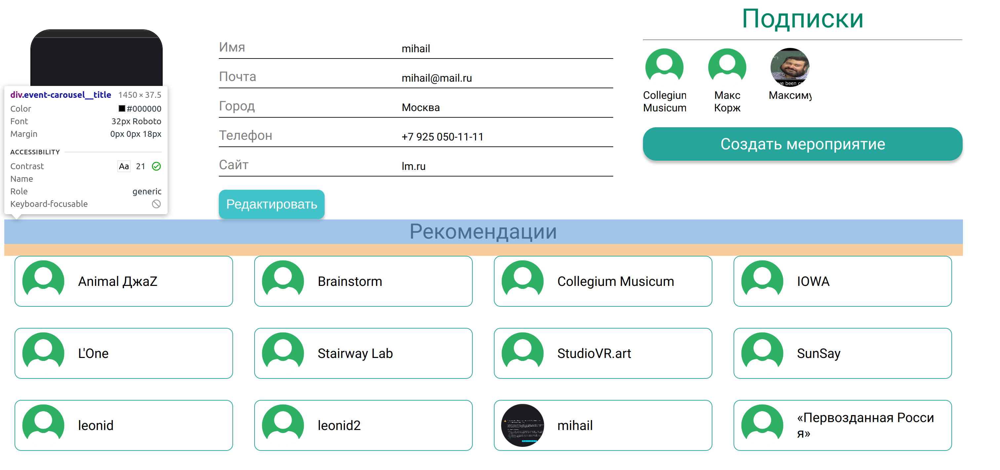
- Подписки
  - ${\color{red} При \ ширине \ страницы \ < \ 1550px \ и \ \geq \ 1250px \ отсутствует \ отступ \ сверху }$ 
    
    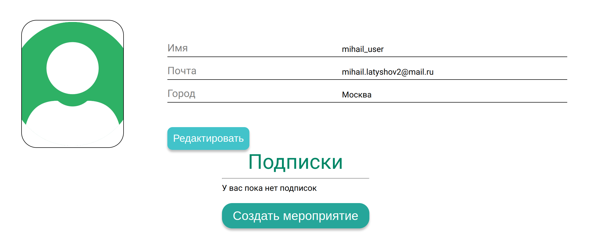
  - Кнопка "Подписки" 
    - Подчеркивается при наведении
    - Курсор меняется на указатель при наведении
    - При клике открывается [модальное окно подписок](#модальное-окно-подписок)
  - При отсутствии подписок 
    - ${\color{red} При \ ширине \ страницы \ < \ 1250px, \ отсутствует \ надпись \ "У \ вас \ нет \ подписок" }$
    - При ширине страницы >= 1250px есть надись "У вас нет подписок"
    
    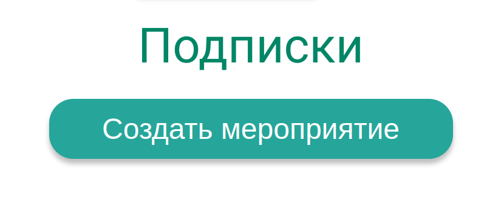
  - При наличии подписок, они отображаются под кнопкой "Подписки"
    - ${\color{red} Подписки \ не \ выровнены \ по \ центру}$
    - ${\color{red} При \ ширине \ страницы \ < \ 1550px \ и \ \geq \ 1250px \ подписка \ вылезает \ за \ пределы }$
      
      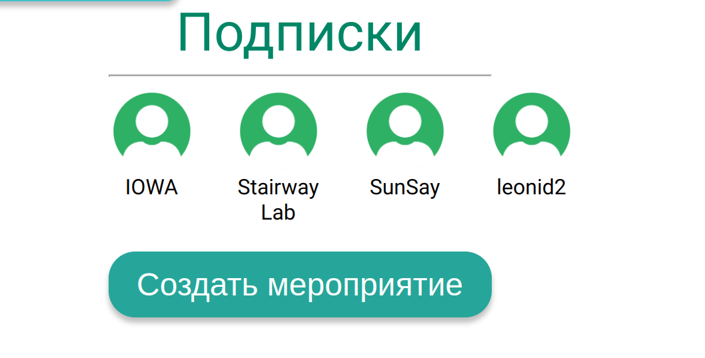
    - Длинные имена обрезаются, что не ломает верстку
    - При наведении на подписку подсвечивается текст и обводится картинка
    - При клике на подписку открывается страница нужного пользователя. [Страница другого пользователя](#страница-другого-профиля)
    - При количестве подписок больше 4 выводятся только 4 подписки 
- Отображаются поля профиля
- Кнопка "Создать мероприятие" описана в [Кнопка "Создать мероприятия"](#кнопка-создать-мероприятия)

## Страница личного профиля
- Рекомендации
  - ${\color{red} Пользователь \ видит \ сам \ себя \ в \ рекомендациях }$
  - При наведении на карточку рекомендации:
    - ${\color{red} Акивной \ зоной \ является \ только \ текст \ и \ картика }$
      - Курсор меняется на указатель 
      - Является ссылкой
    - ${\color{red} Картинка \ не \ меняется }$
    - ${\color{red} Карточка \ не \ меняется }$
    - Текст подсвечивается 
  - При клике на актвиную зону карточки открывается страница нужного пользователя. [Страница другого пользователя](#страница-другого-профиля)

- Кнопка "Редактировать профиль" переключает на режим [редактирование профиля](#редактирование-профиля)    

## Страница другого профиля
- ${\color{red} Кнопка \ подписаться \ является \ инпутом \ с \ типом \ текст }$

  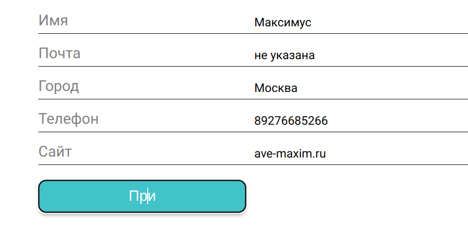
- Если не подписаны на пользователя, отображается кнопка "Подписаться"
- Если подписаны на пользователя, отображается кнопка "Отписаться"
- При клике на кнопку "Подписаться"
  - Подписывает на пользователя 
  - Кнопка меняется на "Отписаться"
  - На странице личного профиля появляется новая подписка
- При клике на кнопку "Отписаться"
  - Отписывает от пользователя 
  - Кнопка меняется на кнопку "Подписаться"
  - На странице личного профиля удаляется подписка
- Если пользователь создавал мероприятия, то они отображаются в виде [карточек мероприятий](#карточка-мероприятия)

## Редактирование профиля
- ${\color{red} Не \ выдаются \ ошибки \ при \ любой \ ошибке }$
- Картинка профиля
  - ${\color{red} Не \ видно \ иконку \ редактирования \ на \ белом \ фоне \ (нет \ обводки) }$
    
    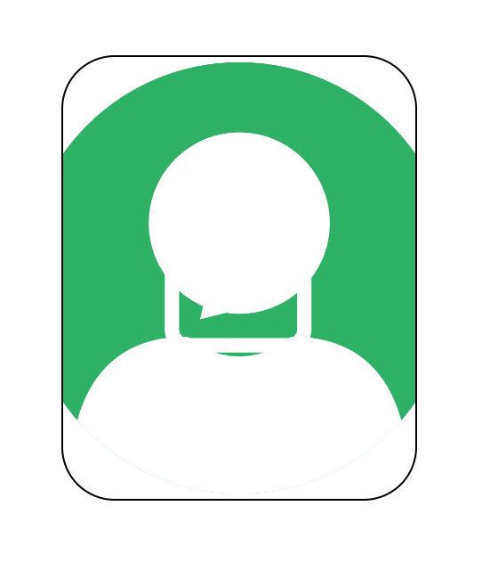
  - При наведении 
    - Иконка редактирования меняет цвет
    - Курсор меняется на указатель
  - При клике 
    - Открывается диалоговое окно системы для выбора изображения
    - Картинка меняется на новую, если выбрали картинку 
    - Картинка не меняется, если не выбрана картинка
    - ${\color{red} При \ выборе \ формата \ svg \ картика \ отображается \ до \ сохранения, \ после \ сохранения \ она \ исчезает \ и \ показывается \ alt }$
  
      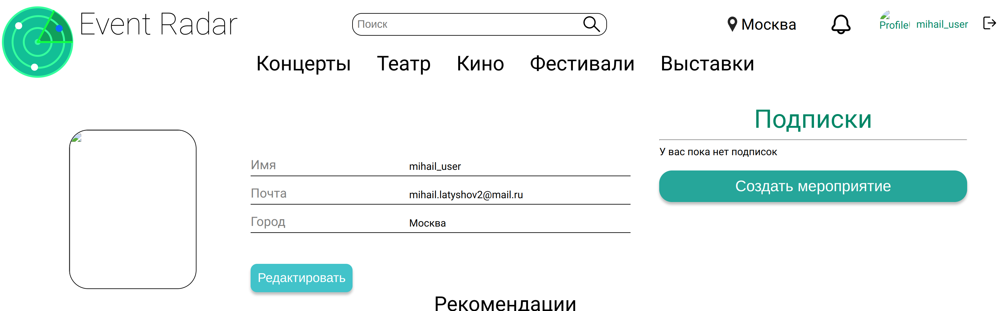
    - ${\color{red} При \ выборе \ формата, \ который \ не \ является \ картинкой, \ отображается \ alt, \ после \ сохранения \ так же \ показыется \ alt }$
    - Если картика больше 5 МБ, то картинка остается как раньше
- Имя профиля
  - ${\color{red} В \ имя \ нельзя \ добавить \ пробел }$
  - Имеет ограниченный набор допустимых символов
  - Имя не меняется, если оно уже занято
- Почта 
  - Если почта занята или имеет неверный формат, то после сохранения
    - ${\color{red} Отображается \ новая \ неверная \ почта }$
    - После перезагрузки страницы почта отображается как до изменения 
  - Имеет ограниченный набор допустимых символов
  - Проверяется формат
- Город
  - ${\color{red} Нет \ стилей \ для \ селекта }$
  - ${\color{red} После \ сохранения \ ни \ на \ что \ не \ влияет }$
- Телефон
  - Если телефон имеет неверный формат, то после сохранения
    - отображается как до изменения
    - ${\color {red} никаких \ подсказок \ не \ появляется}$
  - Если телефон имеет верный формат, то после сохранения
    - ${\color {red} Поле  \ "Телефон" \ пропадает \ и \ появляется \ только \ после \ обновления \ страницы}$
- Сайт
  - Если сайт имеет неверный формат, то после сохранения
    - отображается как до изменения
    - ${\color{red} никаких \ подсказок \ не \ появляется}$
  - Если сайт имеет верный формат, то после сохранения
    - ${\color {red} Поле  \ "Сайт" \ пропадает \ и \ появляется \ только \ после \ обновления \ страницы}$
- При клике на "Отменить" все изменения отменяются и возвращается в обычный режим
- При клике на "Сохранить"
  - ${\color{red} Кнопка \ "Создать \ мероприятие" \ становится \ инпутом \ с \ типом \ текст }$
  - Страница возвращается в обычный режим

## Модальное окно подписок
- ${\color{red} При \ отсутствии \ подписок \ не \ пишет \ об \ этом }$

- ${\color{red} Нет \ отступа \ от \ кнопки \ статус \ подписки }$

  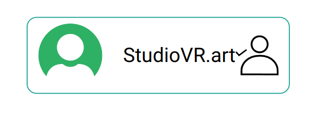
- Если подписаны на пользователя, его кнопка статуса подписки не активна

- Карточка имеет активную зону на картинке, тексте и кнопке подписаться 

- При клике на текст или картинку переходит на профиль пользователя и закрывается модальное окно. [Страница другого пользователя](#страница-другого-профиля)

- При наведении на кнопка подписаться
  - Меняется курсор на указатель
  - Меняется цвет 

- Поиск 
  - Ищет среди всех пользователей и пользователей на которых подписаны отдельно
  - Не отображается свой профиль
  - Отбрасывает пробелы в начале и в конце 
  - При повторном открытии сохраняется поле поиска
  - В поле "Все пользователи" не поподают пользователи, на которых уже подписаны
  - Если не найдены пользователи, то выводится сообщение (Пользователей с таким именем не найдено)

- На странице личного профиля
  - Отображаются подписки личного профиля
  - При клике на кнопку подписаться
    - Подписывает на пользователя 
    - Пользователь появляется в подписках в модальном окне и на странице профиля

- На странице другого профиля
  - ${\color{red} Кнопки \ статуса \ подписки \ отображаютя \ не \ для \ личного \ профиля \ (не \ дает \ подписаться \ на \ подписки \ других \ пользователей; \ Пользователи \ на \ которых \ подписаны \ имеют \ кнопку \ подписаться) }$
  - Отображаются подписки этого пользователя
  - При клике на кнопку подписаться
    - Если не подписаны на него
      - Подписывает на пользователя  
      - Пользователь появляется в подписках в модальном окне
    - ${\color{red} Если \ подписаны \ на \ него, \ то \ ничего \ не \ происходит \ (кнопка \ не \ должна \ быть \ активной) }$ 

## Модальное окно организатора
- При нажатии на кнопку "создать мероприятие" пользователем, не являющимся организатором, открывается модальное окно организатора
- При нажатии на кнопку "стать организатором" без заполнения поля "Телефон" появляется подсказка "телефон не указан"
- При заполнении поля "Телефон" невалидными данными (наличие букв, спец. символов) появляется подсказка "Неправильный номер телефона"
- ${\color{red} При \ заполнении \ поля \ "Телефон" \ номером \ из \ 12 \ цифр, \ подсказка \ не \ появляется, \ но \ в \ профиле \ отображаются \ только \ первые \ 11 \ символов }$
- Пользователь становится организатором вне зависимости от содержимого поля "Сайт"

## Создание мероприятия
- При заполнении на странице создания мероприятия полей следующим образом:
  - Поле "Название мероприятия" содержит названия не используемое уже существующими на сайте мероприятиями, длинной не более 128 символов
  - Поле "Дата начала" содержит дату в будущем
  - Поле "Время начала" содержит время
  - Поле "Категория" содержит одно из следующих значений: "Концерты", "Театр", "Кино", "Фестивали", "Выставки"
  - Место проведения выбрано
  - Картинка выбрана
  И нажатии на кнопку "Создать"
  - Пользователя перекидывает на главную страницу
  - Созданное мероприятие появляется на странице "Все мероприятия"
  - Созданное мероприятие появляется в карусели "Все мероприятия"
  - Созданное мероприятие появляется в профиле пользователя

- При попытке создать мероприятие без названия
  - Мероприятие не создаётся
  - Появляется подсказка "Забыли указать название"
 
- При попытке создать мероприятие с названием длиннее 128 символов
  - Мероприятие не создаётся
  - ${\color {red} Отображается \ ошибка \ Internal \ server \ error }$

- При попытке создать мероприятие без описания
  - Мероприятие не создаётся
  - Появляется подсказка "Нет подробного описания"
  
- ${\color{red} При \ создании \ мероприятия \ без \ даты \ начала, \ мероприятие \ создаётся, \ но \ не \ отображается \ ни \ на \ главной \ странице, \ ни \ в \ профиле}$

- При попытке создать мероприятие без времени начала
  - Мероприятие не создается
  - Появляется подсказка "Время начала обязательно"

- При попытке создать мероприятие с временем начала позже времени окончания
  - Мероприятие не создаётся
  - Появляется подсказка "Время окончания мероприятия не может быть раньше времени начала"

- Создание тегов
  - При перечислении в поле "Теги" через запятую тегов длинной не более 64 символов, теги появляются на странице мероприятия
  - При попытке создание тега длинной более 64 символов
    - Мероприятие не создаётся
    - ${\color{red} Отображается \ ошибка \ Internal \ server \ error }$
    - ${\color{red} При \ создании \ двух \ одинаковых \ тегов, \ на \ странице \ мероприятия \ отображаются \ оба}$
  - При попытке создания мероприятия с пустым полем тегов
    - Мероприятие создаётся
    - ${\color {red} На \ странице \ мероприятия \ отображается \ один \ пустой \ тег }$ 

- Создание места
  - При создании места с непустым уникальным названием и выбранной геопозицией
    - Место появляется в списке доступных мест
    - ${\color{red} Место \ не \ выбирается \ в \ качестве \ места \ проведения \ мероприятия \ автоматически}$
  - При попытке создать место без названия
    - Место не создаётся
    - Появляется подсказка "Введите имя!"
  - При попытке создать место с неуникальным названием
    - Место не создаётся
    - ${\color{red} Появляется \ подсказка \ на \ английском \ "Such \ place \ already \ exists"}$
  - При попытке создать место без геопозиции
    - Место не создаётся
    - Появляется подсказка "Выберите место на карте!"
  - При попытке создать место с названем более 256 символов
    - Место не создаётся
    - ${\color {red} Отображается \ ошибка \ Internal \ server \ error }$

- При попытке создать мероприятие без места проведения
  - Мероприятие не создаётся
  - Появляется подсказка "Не выбрано место"

- При попытке создать 2 мероприятия с одинаковыми названиями
  - Мероприятие не создаётся
  - Появляется подсказка "Мероприятие с таким именем уже существует"

- При попытке создать мероприятие без картинки
  - Мероприятие не создаётся
  - Появляется подсказка "Добавьте картинку"

- При нажатии на кнопку "Выберите файл" открывается меню выбора фото

- После выбора изображения
  - Кнопка "Выберите файл" пропадает
  - Выбранное фото отображается со значком редактирования
    - При наведении на изображение значок становится серым
    - При нажатии на изображение открывается меню выбора фото

## Редактирование мероприятия
- Название мероприятия меняется на строку длинной не более 128 символов

- При попытке изменить название мероприятия на строку длиннее 128 символов
  - Название не меняется
  - ${\color {red} Отображается \ ошибка \ Internal \ server \ error }$

- При попытке изменить название мероприятия на пустое
  - Мероприятие не создаётся
  - Появляется подсказка "Забыли указать название"

- При попытке изменить название мероприятия название другого уже существующего мероприятия
  - Название не меняется
  - ${\color {red} Отображается \ ошибка \ Internal \ server \ error }$

- Описание мероприятия успешно изменяется

- При попытке изменить дату начала мероприятия на дату, следующую за датой окончания
  - Дата начала мероприятия не изменяется
  - Появляется подсказка "Время окончания мероприятия не может быть раньше времени начала"

- Дата начала мероприятия успешно изменяется на любую дату текущего года, предшествующую дате окончания

- При попытке изменить дату окончания мероприятия на дату в прошлом
  - Дата окончания не изменяется
  - Появляется подсказка "Мероприятие неактуально"

- Теги
  - При редактировании мероприятия, все введённые при создании мероприятия теги отображаются в поле "теги" через запятую
  - При удалении тегов, они пропадают со страницы мероприятия
  - При добавлении новых тегов длинной не более 64 символов, они появляются на странице мероприятия
  - ${\color{red} При \ создании \ двух \ одинаковых \ тегов, \ на \ странице \ мероприятия \ отображаются \ оба}$
  - ${\color{red} При \ попытке \ создать \ тег \ длинной \ более \ 64 \ символов, \ отображается \ ошибка \ Internal \ server \ error }$

- Место проведения мероприятия успешно меняется

- Картинка мероприятия успешно меняется

- При нажатии на кнопку "Удалить" мероприятие удаляется

## Фильтрация по тегам:

- ${\color{red} Невозможно \ фильтровать \ по \ конкретному \ интересующему \ тегу \, \ если \ его \ нет \ среди \ популярных}$

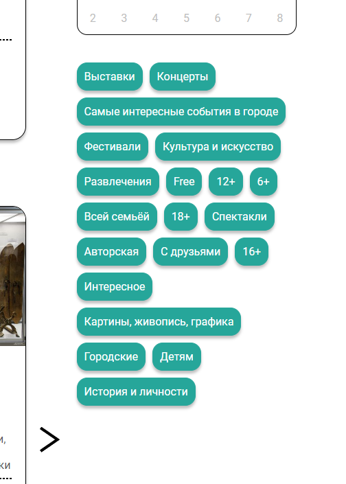
- При выборе хотя бы одного тега, принадлежашего мероприятию, мероприятие отображается на странице.
- При выборе одного или нескольких тегов не принадлежащих мероприятию, мероприятие не отображается на странице.
- Если не выбран ни один тег, отображаются все мероприятия.

## Фильтрация по городу

- При выборе города отображается мероприятие, географические координаты места которого соответствуют выбранному городу.

## Фильтрация по категориям

- При выборе категории, на странице не отображаются мероприятия с другими категориями или без категорий.
- Если не выбрана категория, то отображаются все мероприятия.

## Фильтрация по названию

- При фильтрации по названию отображается мероприятия с подстрокой в названии (пробелы в конце и в начале поисковой подстроки не влияют на результат)

## Поиск по карте

- ${\color{red} На \ карте \ отображаются \ не \ все \ мероприятия \ (В \ качестве \ примера \ мероприятия \ в \ Казани \ и \ Чебоксарах, \ места \ которых \ располагаются \ в \ соответствующих \ городах, \ но \ не \ видны \ на \ общей \ карте)}$

Глобальная карта:
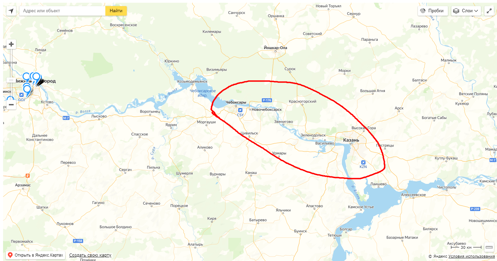
Карта в карточках событий:
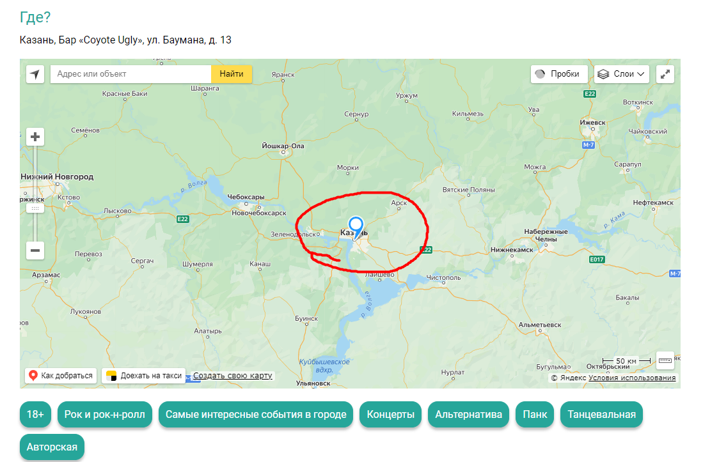
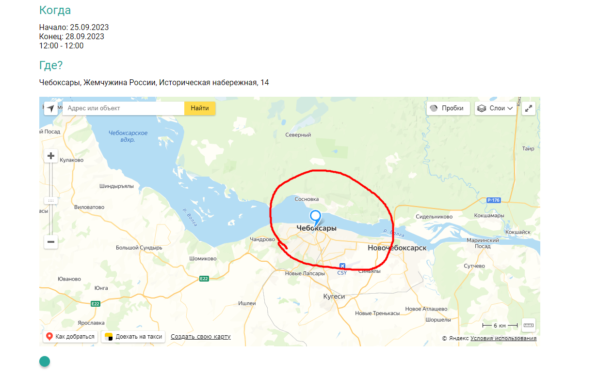

## Фильтрация по датам:
- ${\color{red} На \ календаре \ никак \ не \ выделяется \ текущая \ дата}$
- При выборе одной даты на календаре она выделяется
- При выборе двух дат одного месяца на календаре выделяется интверал дат между ними.
- ${\color{red} При \ выборе \ двух \ дат \ разных \ месяцев \ на \ календаре \ выделяются \ только \ даты \ выбранного \ месяца}$

Например при выборе интервала 27.11.2023 - 22.12.2023:
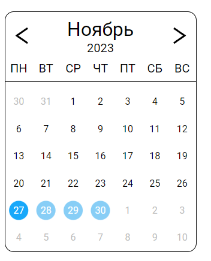
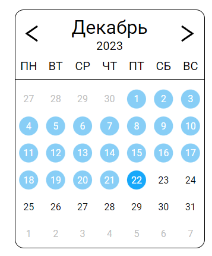

- ${\color{red} Не \ отображаются \ мероприятия \ в \ городах, \ где \ уже \ наступил \ день \ начала \ мероприятия, \ если \ тот \ же \ день \ еще \ не \ наступил \ по \ московскому \ времени}$
- Если не выбрана дата на календаре, не отображаются мероприятия в интервал даты проведения которых не попадает текущая дата
- Если выбран интервал дат, то не отображаются мероприятия интервал дат которых не пересекается с выбранным интервалом

## Сброс фильтров:

### На странице со всеми мероприятиями
- Если строка поиска пустая, то при нажатии кнопки "Сбросить фильтры" убираются подсвеченные выбранными теги, категории и даты, и отображаются все мероприятия.
- ${\color{red} Если \ строка \ поиска \ не \ пустая, \ то \ при \ нажатии \ кнопки \ Сбросить \ фильтры \ строка \ поиска \ не \ изменяется, \ и \ ее \ нельзя \ снова \ активировать}$ 
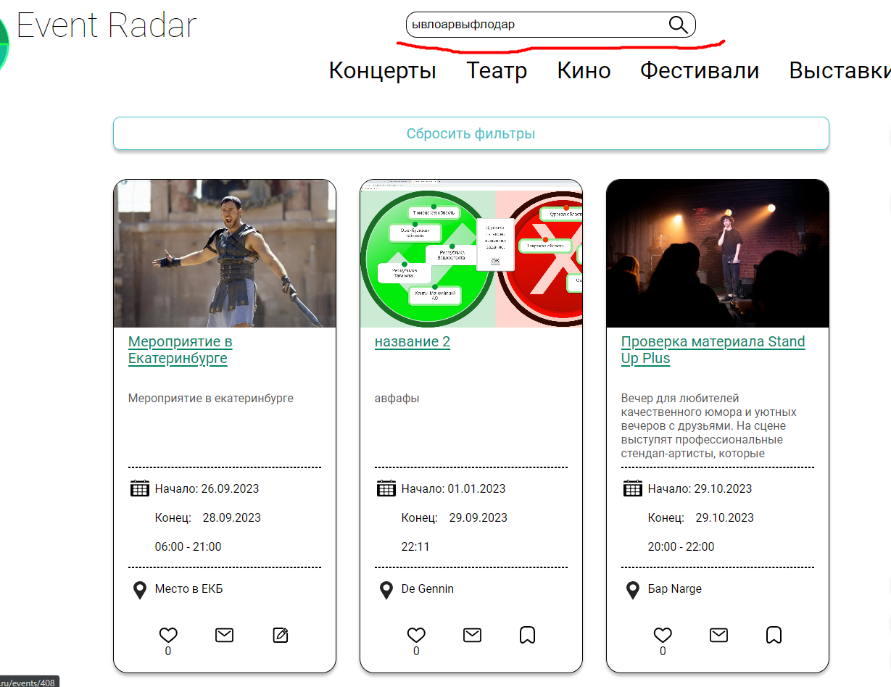

### На главной странице

При нажатии на логотип поведение идентичное нажатию "Сбросить фильтры" на странице со всеми мероприятиями.

### При выходе со страницы мероприятия

- При выходе нажатием на одну из категорий сбрасываются старые фильтры и применяется фильтр выбранной категории
- ${\color{red} При \ выходе \ нажатием \ на \ логотип \ сервиса \, \ сбрасываются \ все \ фильтры \.}$
