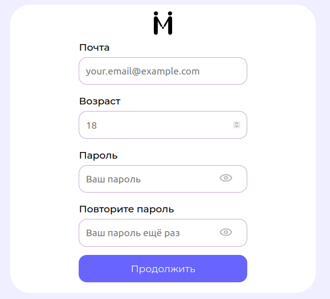
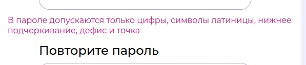
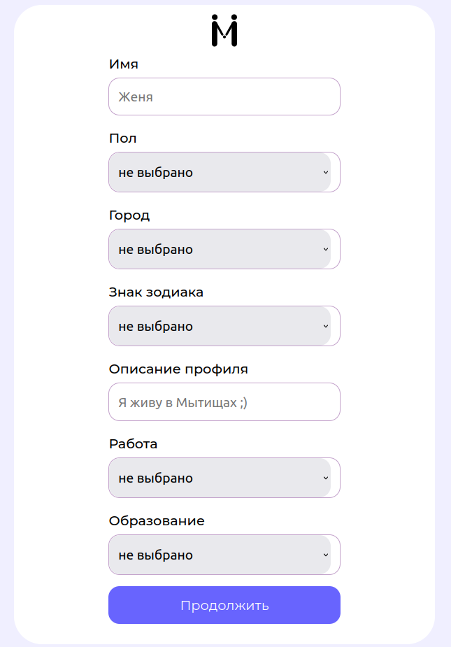
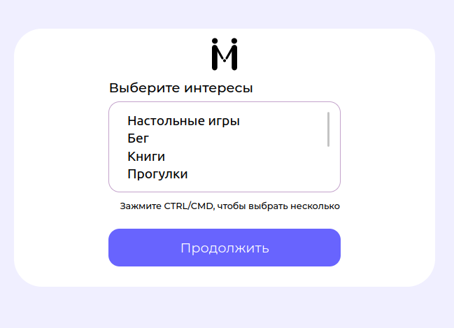
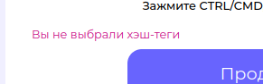
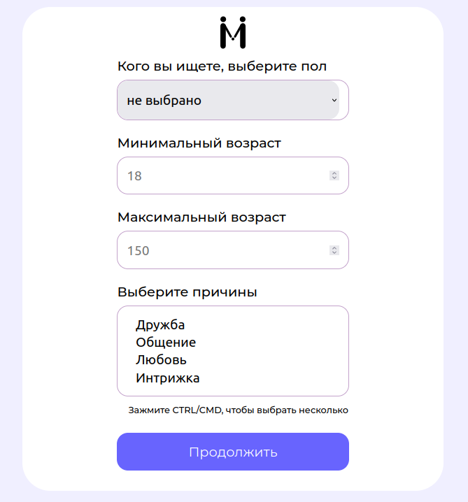
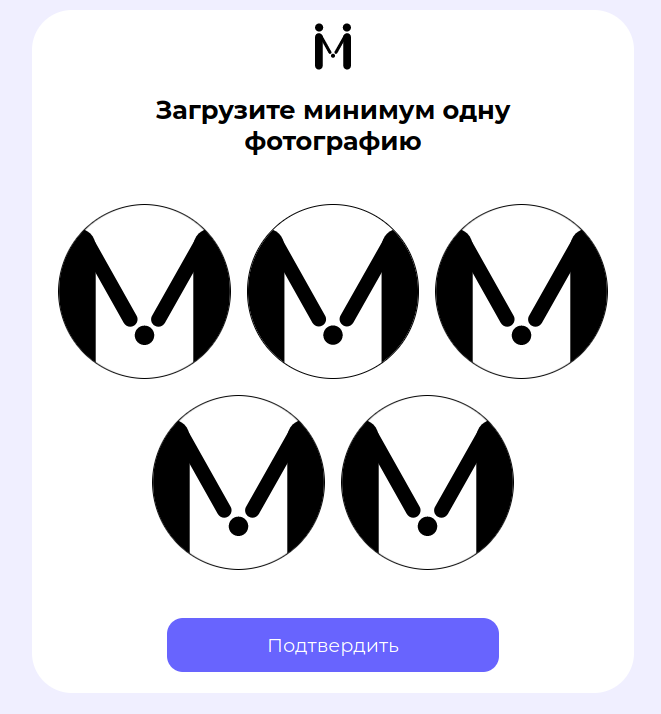
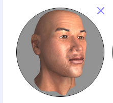
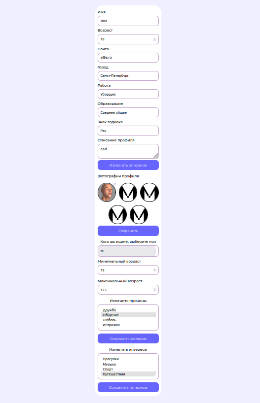

MRGA QA HW1

## Авторизация

1. Успешно логинит аккаунт при введении существующих логина и пароля ✅
1. В примере почты указывается домен mail.ru 🤔
    - Спорное решение в случае, если Meetme не сотрудничает в mail.ru
    - Юридически  [гарантированно верным решением](https://ru.wikipedia.org/wiki/%D0%94%D0%BE%D0%BC%D0%B5%D0%BD%D1%8B_%D0%B4%D0%BB%D1%8F_%D0%BF%D1%80%D0%B8%D0%BC%D0%B5%D1%80%D0%BE%D0%B2) будет указать example.com

## Регистрация
### Указание основной информации

#### Емейл
1. Предупреждает, если емейл уже занят, только при нажатии кнопки "продолжить" ✅
    - Не перегрузит БД частыми запросами, как если бы проверялось на каждый символ
1. Нет проверки на длину емейла ❌
    - Удалось указать емейл длиной более 2к символов
    - Это открывает возможность злоумышленникам вызвать DDoS через заполнение места на диске сервера
1. Удалось ввести некорректный емейл %@%.% ❌
    - Следует использовать готовые решения для валидации емейла
    - Или хотя бы использовать символ \w (цифро-буквенный символ) вместо . (любой символ) в регексе для проверки
#### Возраст
1. В поле возраст можно ввести только число в корректном диапазоне (от 18 до 150) ✅
#### пароль
1. Нет требований к качеству пароля (можно 123456, aaaaaa т.п.) ❌
1. Есть проверка на длину пароля (от 6 до 20) ✅
1. При этом есть ограничения на разрешенные символы пароля ❌

    - Не получится ввести автосгенерированный браузером пароль

### Описание профиля

1. Если выйти из профиля при заполнении профиля, то вернемся к этой же странице (т.е. учетка была создана на прошлом этапе) ✅
    - Можно улучшить, если сохранять введенные данные при выходе (сейчас поля обнуляются при выходе)
#### Имя
1. Имена короче 3 букв считаются некорректными ❌
    - Обладатели имен Ян и Ия не смогут зарегистрироваться
1. Есть проверка на чрезмерно большую длину имени ✅
#### Пол
1. Только М или Ж ✅
#### Город
1. Городов мало - следует пополнить БД 🤔
1. Можно начать вводить название города и он выберется ✅
    - Возможность неочевидна ❌
      - Следует использовать привычные пользователю эл-ты интерфейса для этой фичи - показать мигающий курсор, интерактивно отображать ввод пользователя и т.п.
#### Знак зодиака 
1. По порядку ✅
#### Описание
1. Пример может смутить жителей Мытищ 🤔
1. Есть проверка на чрезмерно большое описание ✅
#### Работа
1. Сложно перечислить все 🤔
    - Лучше использовать категории, чтобы охватить больше профессий и упростить поиск пары
      - "IT" вместо программист
      - "трудяга" вместо уборщик, сварщик
      - "работаю с людьми" вместо учитель
      - "защищаю Родину" вместо прапорщик
#### Образование
1. Категории "среднее общее", "среднее профессиональное", "основное общее", "высшее неоконченное" звучат так, будто делаем анкету на сайте госуслуг, а не в тиндере 🤔
    - Ближе к стилистике СЗ будут "учусь в колледже", "не вижу смысла идти в вуз", "студент", "магистр"

#### Кнопка "продолжить"
1. если не заполнить сразу несколько полей, то при нажатии на кнопку "продолжить" будет сообщаться о незаполнении одно за другим, а не сразу обо всех ❌
    - Это раздражает, когда хочешь указать как можно меньше информации о себе и приходится по много раз проверять "а какие поля я могу не заполнить?"

### Указание хобби

1. Для выбора нескольких хобби необходимо зажать Ctrl ❌
    - В 2023 выглядит как костыль
2. Если не выбрать ни одного хобби, сообщение о хэш-тегах (почему не хобби/интересы/увлечения?) кажется странным ❌

### Параметры поиска

#### Пол
1. Можно выбрать как М/Ж, так и всех сразу ✅

#### Возраст
1. Есть проверка на введенный возраст ✅

#### Причина
1. Можно выбрать сразу несколько ✅
    - Большее поле для маневров 👍
1. Для выбора нескольких вариантов необходимо зажать Ctrl ❌

### Выбор фотографий

1. Требование добавить фотографию лица и проверка через МЛ-модель являются спорным решением 🤔
    - Набирает популярность тенденция на сокрытие информации о себе в интернете и установка в соцсетях анимешной/постироничной/обработанной в фш картинки
    - Требование добавить лицо может раздражать некоторых (как тех, кто ставит анимешную фотку, так и тех, кто любит фоткаться в полный рост), но его легко обойти

### Изменение профиля после регистрации

1. Поля профиля можно изменить после создания профиля ✅
1. Пол изменить нельзя ✅