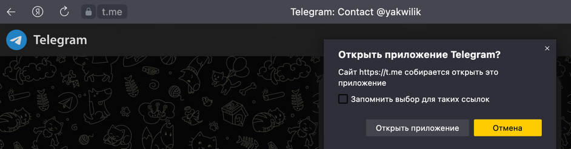

MRGA QA HW1

## Страница совпадений (вкладка в меню "Совпадения")
> Создадим аккаунт
1. У нового аккаунта 0 совпадений, и в сайдбаре правильно отображаются данные пользователя ✅ 
2. При наведении на число лайков появляется курсор, а при нажатии появлется предложение оформить подписку ✅ 
3. Модальное окно с предложением об оформлении закрывается только при нажатии на крестик, при наведении на крестик появляется курсор ✅
4. При наведении на подчеркнутый текст появляется курсор, а при нажатии происходит переход на страницу для связи с админом ✅ 
5. При переходе на страницу для связи с админом страница открывается не в новой вкладке ❌
6. Сайдбар верно отображает, что мы находимся во вкладке "Совпадения"
> Добавим 3 лайка от пользователей, которые нам подходят по фильтрам и 3 пользователя, которые не подходят
1. Отображается количество пользователей, которые нас лайкнули, без учета тех, кто нам не подходит по фильтрам ✅
2. Количество взаимных симпатий отображается правильно ✅
> Превратим лайки в совпадения

1. При первом открытии новые совпадения отображаются с рамкой 
2. Количество лайков изменилось до 0 ✅!
3. На странице появились пользователи, с которыми у нас совпадение, их имена и фотографии отображаются корректно ✅ 
4. Появился призыв написать сообщение ✅
5. При наведении на фотографию появляется курсор ✅
6. При клике на фотографию, появляется поле для ввода первого сообщения c корректными данными пользователя ✅ 

> Добавим много совпадений, чтобы заполнить экран
1. При большом количестве совпадений верстка остается корректной ✅ 
2. Скролл совпадений происходит вместе с (виджетом призыва отправить сообщение / виджетом отправки сообщения) ❌ 

> Оформляем подписку и добавляем лайки
1. При оформленной подписке количество лайков отображается все так же с заблюренным фоном ❌ 
2. При нажатии на количество лайков происходит переход на страницу "Знакомства" и отображаются пользователи, которые нас лайкнули ✅
3. Если лайкнуть пользователя из этой ленты происходит 100% лайк ✅ 
4. Если дизлайнуть пользователя, то появляется уведомление о том, что мы упустили лайк 