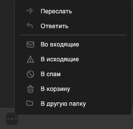

# ДЗ1

Проект: почта с возможностью создания анонимного ящика
Ссылка: https://mailbx.ru

## Содержание
* [1 Регистрация](#1)
* [2. Авторизация](#2)
* [3. Профиль](#3)
* [4. Пароль](#4)
* [5. Анонимный ящик](#5)
* [6. Создание письма](#6)
* [7. Страница письма](#7)
* [8. Папки](#8)
* [9. Список писем](#9)

## Регистрация <a name="1"></a>
> [Ссылка](https://mailbx.ru/signup)

**Имя**
- При нажатии "Создать" в случае пустого инпута всплывает подсказка заполнить поле.
- **Баг**. После попытки регистрации с пустым именем, после ввода имени подсказка пропадает только при нажатии кнопки "Создать" (данный баг повторяется для всех полей ввода на странице).

*Ожидамое поведение:* Подсказка пропадает при вводе текста


**Фамилия**
- При нажатии "Создать" в случае пустого инпута всплывает подсказка заполнить поле. 

**Логин**
- При нажатии "Создать" в случае пустого инпута всплывает подсказка заполнить поле.
- При вводе логина короче 3 символов снизу появляется подсказка "Логин короче 3 символов"
- При вводе логина c символом "@" снизу появляется подсказка "Логин не может содержать @ или ."

**Пароль**
- При нажатии "Создать" в случае пустого инпута всплывает подсказка заполнить поле.
- При вводе пароля короче 5 символов снизу появляется подсказка "Пароль короче 5 символов"
- При повторном вводе пароля который не совпадает с предыдущим появляется подсказка "Пароли не совпадают"
- При нажатии на "глазок" введенный пароль становится виден
- При повторном нажатии на "глазок" введенный пароль скрывается

- При попытке регистрации с уже существующим логином, под полем ввода логина возникнет ошибка "Пользователь уже существует".
- При корректных данных (прошедших валидацию на язык, длину) и уникальном логине при нажатии "Создать" пользователь будет авторизован и перенаправлен на главную страницу.
- При регистрации у пользователя обновляется аватар на дефолтный с первым символом из имени 
- При клике на ссылку "Войти" пользователь будет направлен на страницу авторизации (https://mailbx.ru/login)
- **Баг**. На некоторых браузерах, где есть возможость сгенерировать и запомнить пароль (Yandex, DuckDuckGo) кнопка генерации пароля накладывается на глазок

*Ожидамое поведение:* Глазок скрытия должен быть левее, чтобы не накладываться на менеджеры паролей в браузерах


## Авторизация <a name="2"></a>
> [Ссылка](https://mailbx.ru/login)

**Логин**
- При нажатии "Войти" в случае пустого инпута всплывает подсказка заполнить поле.
- При вводе логина короче 3 символов снизу появляется подсказка "Логин короче 3 символов"
- При вводе кириллицы в логине снизу появляется подсказка "Логин не может содержать кириллицу"
- При вводе логина c символом "@" снизу появляется подсказка "Логин не может содержать @ или ."

**Пароль**
- При нажатии "Войти" в случае пустого инпута всплывает подсказка заполнить поле.
- При вводе пароля короче 5 символов снизу появляется подсказка "Пароль короче 5 символов"

- При клике на ссылку "Зарегистрироваться" пользователь будет направлен на страницу регистрации (https://mailbx.ru/signup)
- При неправильных авторизационных данных при нажатии "Войти" появляется сообщение "Неправильный пароль"
- При корректном логине и пароле при нажатии "Войти" пользователь будет авторизован и перенаправлен на главную страницу.

## Профиль <a name="3"></a>
> [Ссылка](https://mailbx.ru/profile)

**Аватар**
- При нажатии на аватарку, появляется проводник с возможностью выбора файла
- При выброре файла, он успешно изменяется на сайте и текущая аватарка обновляется

**Имя**
- При нажатии "Сохранить" в случае пустого инпута всплывает подсказка заполнить поле
- При изменении имени на другое, у которого отличается первый символ, в случае дефолтной аватарки, аватарка меняется на актуальную с первым символом
- При изменении имени на другое, у которого отличается первый символ, в случае недефолтной аватарки, аватарка не меняется на дефолтную
- **Баг**. При изменении имени на имя, у которого первый символ цифра, аватарка формируется с дважды нарисованной цифрой

*Ожидамое поведение:* Цифра по середине аватара прорисовывается один раз


**Фамилия**
- При нажатии "Сохранить" в случае пустого инпута всплывает подсказка заполнить поле

## Пароль <a name="4"></a>
> [Ссылка](https://mailbx.ru/security)
- При нажатии "Сохранить" в случае пустого инпута всплывает подсказка заполнить поле.
- При вводе пароля короче 5 символов снизу появляется подсказка "Пароль короче 5 символов"
- При повторном вводе нового пароля который не совпадает с предыдущим появляется подсказка "Пароли не совпадают"
- При вводе неправильного старого пароля появлеяется сообщение с ошибкой "wrong password"
- **Баг**. Сообщение об ошибке появляется на английском языке

*Ожидамое поведение:* Язык ошибки должен быть привязан к языку всего веб-приложения
- **Баг**. При вводе пароля отсутствует возможность скрытия содержимого

*Ожидамое поведение:* По умолчанию пароль при вводе скрыт и есть возможность сделать его видимым


## Анонимный ящик <a name="5"></a>

> [Ссылка](https://mailbx.ru/anonymous)

**Создание анонимного ящика** 
   - При нажатии на кнопку "Сгенерировать", генерируется почтовый адрес и добавляется в конец списка
   - При нажатии на кнопку "Сгенерировать" в правом верхнем углу появляется уведомление "email создан успешно!"
     
   - При нажатии на кнопку "Сгенерировать", если количество почтовых адресов равняется пяти, кнопка "Сгенерировать" пропадает
   - **Баг**: При наличии четырех уже созданных анонимных ящиках, если быстро нажать кнопку "Сгенерировать" дважды, то генерируются два ящика (таким образом превышается их максимальное количество) и кнопка не пропадает
      > [Видео](./video/Баг_анон_ящик.mov)

      *Ожидамое поведение:* нельзя создать более 5 анонимных ящиков

**Удаление анонимного ящика**
   - При клике на крестик напротив анонимного ящика, он удаляется
   - При клике на крестик напротив анонимного ящика, в правом верхнем углу появляется уведомление "email удален успешно!"
     

## Создание письма <a name="6"></a>

 - При нажатии на кнопку "Новое письмо", открывается форма создания письма
 - При нажатии на кнопку "Новое письмо", в открывшейся форме в конце тела письма содержится подпись 
    ```
    --
    Отправлено с MailBX
    ```
**Поле ввода "Кому"**
 - В поле ввода можно ввести адрес получателя
 - Если адрес почтового сервиса (то, что после @, включая этот символ) отсутствует, то при смене фокуса на другое поле, адрес получателя автоматически дополняется адресом собственного почтового сервиса (@mailbx.ru)
 - При нажатии на поле ввода появляется список получателей, которым пользователь писал до этого
   
 - При наводке на пользователя в этом списке, поле ввода заполняется его адресом
 - При нажатии на пользователя из списка отправителей, поле ввода заполняется и вокруг него появляется рамка с крестиком
   
 - При нажатии на крестик напротив получателя, получатель удаляется из поля ввода
 - При нажатии на адрес получателя, его можно изменить
 - Есть возможность указать несколько получателей

**Поле ввода "От кого"**
 - При нажатии на кнопку "От кого", появляется одноименное дополнительное поле ввода
 - По умолчанию поле ввода заполнено основным почтовым адресом отправителя
 - При нажатии на адрес отправителя, появляется список его анонимных ящиков
 - При нажатии на любой из анонимных ящиков, этот почтовый адрес заменяет то, что было в поле ввода до этого

**Поле ввода "Тема"**
 - В поле ввода можно ввести последовательность символов любой длины
  
**Поле ввода тела письма**

 - При нажатии на иконку с буквой "Ж" (или сочетания клавиш `ctrl+B`), текст, который будет написан после этого, будет жирным
   
 - Если какой-либо текст в теле письма выделен, при нажатии на иконку с буквой "Ж" (или сочетания клавиш `ctrl+B`), этот текст станет жирным
 - При нажатии на иконку с буквой "К" (или сочетания клавиш `ctrl+I`), текст, который будет написан после этого, будет курсивным
   
 - Если какой-либо текст в теле письма выделен, при нажатии на иконку с буквой "К" (или сочетания клавиш `ctrl+I`), этот текст станет курсивным
 - При нажатии на иконку с буквой "<u>Ч</u>" (или сочетания клавиш `ctrl+U`), текст, который будет написан после этого, будет подчеркнутым
   
 - Если какой-либо текст в теле письма выделен, при нажатии на иконку с буквой "<u>Ч</u>" (или сочетания клавиш `ctrl+U`), этот текст станет подчеркнутым
 - При нажатии на иконку с буквой "~~A~~", текст, который будет написан после этого, будет зачеркнутым
   
 - Если какой-либо текст в теле письма выделен, при нажатии на иконку с буквой "~~A~~", этот текст станет зачеркнутым
 - При нажатии на иконку с буквой "T^2" текст, который будет написан после этого, будет в верхнем регистре
   
 - Если какой-либо текст в теле письма выделен, при нажатии на иконку с буквой "T^2", этот текст станет в верхнем регистре
 - При нажатии на иконку с буквой "T_2" текст, который будет написан после этого, будет в нижнем регистре
   
 - Если какой-либо текст в теле письма выделен, при нажатии на иконку с буквой "T_2", этот текст станет в нижнем регистре
 - При нажатии на кнопку "Выравнивание слева", текущая строка будет выровнена по левому краю
   
 - Если какой-либо текст в теле письма выделен, при нажатии на "Выравнивание слева", этот текст станет выровнен по левому краю 
 - При нажатии на кнопку "Выравнивание справа", текущая строка будет выровнена по правому краю
   
 - Если какой-либо текст в теле письма выделен, при нажатии на "Выравнивание справа", этот текст станет выровнен по правому краю 
 - При нажатии на кнопку "Выравнивание по центру", текущая строка будет выровнена по центру
   
 - Если какой-либо текст в теле письма выделен, при нажатии на "Выравнивание по центру", этот текст станет выровнен по центру
 - При нажатии на кнопку "Назад", последнее выполненное действие отменяется
 - При нажатии на кнопку "Вперед", последнее отмененное действие повторяется
 - При нажатии на кнопку "Очистить", весь выделенный текст становится отформатирован по умолчанию
 - При наведении на любую из кнопок форматирования текста, появляется подсказка, описывающая для чего эта кнопка
   

**Действия с письмом**
> Действия с письмом в форме его создания представлены ниже:
> 
 - При нажатии на крестик в правом верхнем углу формы, появляется окно с текстом "Сохранить черновик?"
   
 - При нажатии на кнопку "Отменить" в нижней части формы, письмо закрывается без сохранения
 - При нажатии на кнопку "Сохранить" в нижней части формы, письмо закрывается и сохраняется в папку "Черновики"
 - При нажатии на кнопку "Сохранить" в нижней части формы, в правом верхнем углу появляется уведомление "Черновик сохранен."
   
 - Если письмо полностью пустое, при сохранении ошибок не возникает
 - При нажатии на кнопку "Отправить" в нижней части формы, письмо закрывается и отправляется всем получателям
 - При нажатии на кнопку "Отправить" в нижней части формы, в правом верхнем углу появляется уведомление "Письмо отправлено успешно!"
   
 - При нажатии на кнопку "Отправить" в нижней части формы, если письмо полностью пустое, появляется ошибка "В списке получателей нет ни одного существующего!" в правом верхнем углу
   
 - При нажатии на кнопку "Отправить" в нижней части формы, если все получатели письма не зарегистрированы в нашем сервисе, появляется ошибка "В списке получателей нет ни одного существующего!"
 - При нажатии на кнопку "Отправить" в нижней части формы, если хотя бы один получатель существует в нашем сервисе или хотя бы один является пользователем внешнего сервиса, письмо отправляется без ошибок
 - При нажатии на кнопку "Отправить" в нижней части формы, если в списке получателей были несуществующие пользователи нашего сервиса, отправителю приходит письмо от `support@mailbx.ru` с текстом о том, что письма несуществующим пользователям не были отправлены
   
 - При нажатии на кнопку "Отправить" в нижней части формы, если все получатели - пользователи сторонних сервисов, письмо отправляется успешно

## Страница письма <a name="7"></a>
> https://mailbx.ru/{folder_slug}/{id}
> 
> Действия с письмом на его странице представлены ниже:
> 
> 
 - Если длина темы письма превышает 180 символов, символы, которые идут после 180-го, заменяются на троеточие
 - При нажатии на кнопку "Переслать" в нижней части письма, открывается форма письма, в которой:
   - Тема письма заполняется автоматически темой пересылаемого сообщения
   - В тело добавляется текст пересылаемого сообщения
 - При нажатии на кнопку "Ответить" в нижней части письма, открывается форма письма, в которой:
   - Тема письма заполняется автоматически темой пересылаемого сообщения с приставкой "RE:"
   - В тело добавляется текст пересылаемого сообщения, а также его отправитель и время отправки
 - При нажатии на кнопку "..." в нижней части письма, открывается вспомогательное окно с дополнительными действиями: переслать, ответить, переместить во входящие, исходящие, спам, корзину или в другую папку
   
 - При наведении на любую из трех кнопок (переслать, ответить и троеточие), появляется подсказка, описывающая для чего эта кнопка
   

## Папки <a name="8"></a>
**Создание папки**
 - При нажатии на кнопку "Новая папка" всплывает окошко с предложением выбрать имя папки
 - При нажатии кнопки "Создать" в форме создании папки:
   - Создается папка с заданным именем
   - При пустом поле вылетает ошибка с просьбой ввести название папки
 - При нажатии кнопки "Отменить" в форме создании папки:
   - Закрывается окошко с предложением выбрать имя папки
 - **Улучшение**: Имя папки ограничено по длине
  
**Действия с папкой**
 - При нажатии правой кнопкой мыши на папку всплывает окно с кнопками: переименовать и удалить
 - При нажатии на кнопку "Переименовать" в дополнительном окне, всплывает окошко с предложением выбрать имя папки
   - При нажатии кнопки "Переименовать" в форме изменения названия папки:
     - Меняется имя папки
     - При пустом поле вылетает ошибка с просьбой ввести название папки
   - При нажатии кнопки "Отменить" в форме изменения названия папки, закрывается окошко с предложением выбрать имя папки
 - При нажатии на кнопку "Удалить" в дополнительном окне вылетает окошко с подтверждением выбора:
   - При нажатии на кнопку "Удалить", папка удаляется
   - При нажатии на кнопку "Отменить" закрывается окошко с подтверждением выбора
 - **Улучшение**: при удалении папки можно показать пользователю, что все письма, находящиеся в этой папке, перемещаются в корзину
 - При нажатии на папку, открывается страница, содержащая письма в этой папке (https://mailbx.ru/{folder_slug})

**Стандартные папки**
 - При нажатии на кнопку "Входящие" открывается список писем, которые пришли пользователю
 - При нажатии на кнопку "Исходящие" открывается список писем, которые пользователь отправил
 - При нажатии на кнопку "Черновик" открывается список писем, которые сохранил, но еще не отправил
 - При нажатии на кнопку "Спам" открывается список писем, которые пользователь пометил спамом
 - При нажатии на кнопку "Корзина" открывается список писем, которые пользователь решил удалить
 - При нажатии правой кнопкой мыши на стандартные папки, не появляется окно с кнопками "удалить/переименовать"

## Список писем <a name="9"></a>
> https://mailbx.ru/{folder_slug}

**Действия с письмами**
 - При нажатии на письмо левой кнопкой мыши, открывается страница письма https://mailbx.ru/{folder_slug}/{id}
 - При нажатии на письмо правой кнопкой мыши, открывается диалоговое окно с действиями: переслать, ответить, во входящие, в исходящие, в спам, в корзину, в другую папку
 - При нажатии на кнопку "Переслать" в диалоговом окне, открывается страница создания письма с заполненным текстом
 - При нажатии на кнопку "Ответить" в диалоговом окне, открывается страница создания письма с заполненным адресатом
 - При нажатии на кнопку "Во входящие" в диалоговом окне, письмо перемещается в папку "Входящие"
 - При нажатии на кнопку "В исходящие" в диалоговом окне, письмо перемещается в папку "Исходящие"
 - При нажатии на кнопку "В спам" в диалоговом окне, письмо перемещается в папку "Спам" и все письма, которые приходят от отправителя данного письма попадают в папку "Спам"
 - При нажатии на кнопку "В корзину" в диалоговом окне, письмо перемещается в папку "Корзина"
   - При открытии папки "Корзина", к письмам лежащим в ней в в диалоговое окно добавляется действие "Удалить"
 - При нажатии на кнопку "В другую папку" в диалоговом окне, всплывает окно со списком ранее созданных папок, в одну из которых будет перемещено письмо по выбору пользователя
 - При наведении на письмо появляются кнопки выделения письма и кнопка статуса письма:
   - При нажатии на кнопку выделения письма, на письмо распространяются все действия как при нажатии правой кнопкой мыши на письмо
   - При нажатии на кнопку статуса письма, письмо становится прочитанным/непрочитанным
 - При нажатии на кнопку "Выделить все":
   - На выделенные 1...n писем распространяются все действия как при нажатии правой кнопкой мыши на письмо
 - При нажатии на кнопку "Фильтр" появляется окно с кнопками: сначала новые и сначала старые
 - При нажатии на "Сначала новые" письма сортируются по уменьшению времени
 - При нажатии на "Сначала старые" письма сортируются по увеличению времени
 - **Улучшение**: Добавить действия "Избранное", "Непрочитанные" при нажатии на кнопку "Фильтр"
